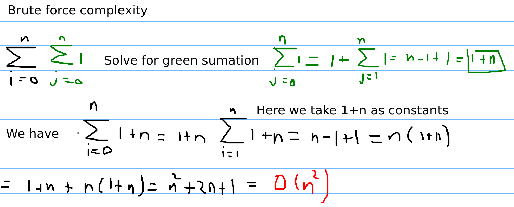
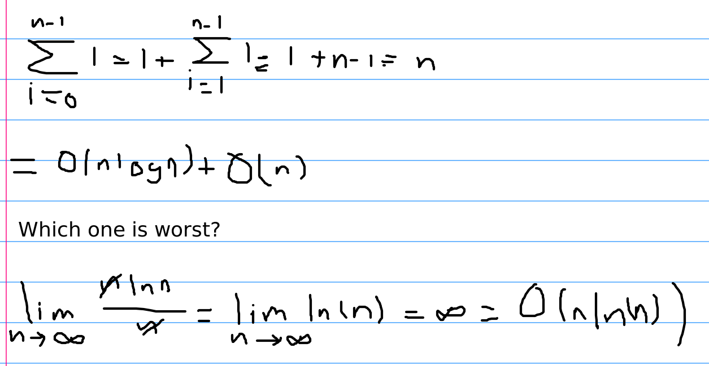

# How to run

`python3 <file.py> < test.txt`

# Functions

- **brute_force:** The idea from of the function **brute_force** is to use **in** operator to find the element in our list, the problem with using **in** operator with lists it's the complexity, usually **in** operator complexity is **O(N)**

- **containsDuplicate:** The idea is to sort the array, if we want to find a duplicate, we can sort it first, so we have: </br>

```
[2,2,3,3,1,1]
After sorting
[1,1,2,2,3,3]
```

In this way it's easier to find a duplicated element, we only need to iterate in our list and check if the next element is equal or not </br>

- **hash_map:** The idea is to take advantage of constant time for seaching in our hash map, we iterate in our array and check if the number is in our hash map, if not, we only add the number into our hash map

# Complexity

- **brute_force:** Is **O(N^2)** because the use of **in** operator in our list </br>



- **ContainsDuplicate:** Is **O(NlogN) + O(N) = O(NlogN)** because we sort it first and then iterate in the entire list </br>



- **Hash_map:** We are iterating in our list length so **O(N)**, assuming that searching in the hash map is **O(1)**, because hash map is being used, the space complexity is **O(N)**

# References 

- [Contains duplicate](https://leetcode.com/problems/contains-duplicate/description/)
- [Complexity of IN operator in Python](https://stackoverflow.com/questions/13884177/complexity-of-in-operator-in-python)
- [One line python solution](https://leetcode.com/problems/contains-duplicate/solutions/60850/one-line-solution-in-python/)