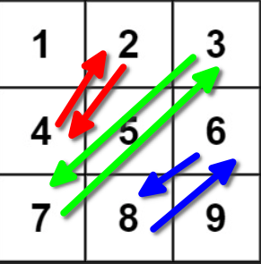

# Explanation

## How to run

Run **test.py** this contains the test cases for the algorithm, </br>
the **rotate.py** is the main algorithm. </br>

## Algorithm

The algorithm is simple, transpose the matrix and then reverse the row, </br>
Taking as an example this matrix: </br>

```python
[[1,2,3], 
 [4,5,6],
 [7,8,9]
```

We transpose the matrix: </br>

```python
[[1,4,7], 
 [2,5,8],
 [3,6,9]
```

And finally we reverse the rows: </br>

```python
[[7,4,1], 
 [8,5,2],
 [9,6,3]
```

When we transpose the matrix, we need to swap the corresponding </br>
values in this way </br>



## Time/Space complexity

- **Time complexity**: Time complexity would be **O(N^2)** because we iterate </br>
in our entire matrix. </br>
- **Space complexity**: Would be **O(1)** because we aren't using extra space. </br>

# References

- [Leetcode problem](https://leetcode.com/problems/rotate-image/description/)
- [Matriz Transpuesta](https://es.wikipedia.org/wiki/Matriz_transpuesta)
